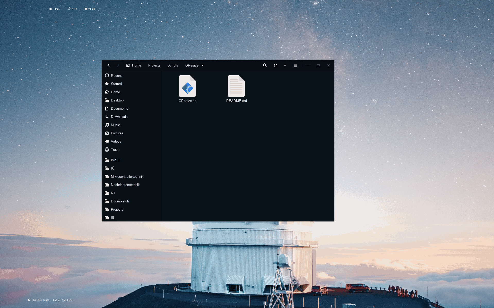

# GResize
Simple script to resize X-Windows to golden ratio rectangles using xwininfo and wmctrl

## Arguments
### -w, -h
`-w`: change width based on height
`-h`: change height based on width

### -u
`-u`: upscale. If omitted, downscale
